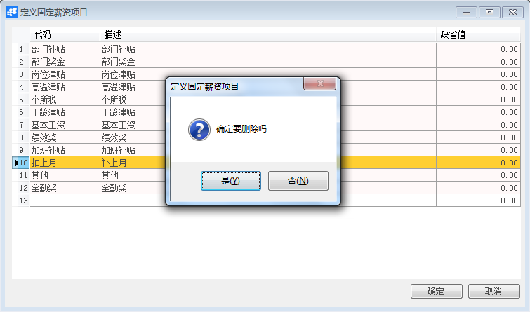

## 定义固定薪资项目 

 

## 功能解释 

定义固定薪资项目是指初始化企业的员工薪资中的固定项目，如：基本工资、全勤奖等。固定薪资项目的设定，方便用户后期对此类数据的维护：更新数据值、数据导入与数据导出。

## 文章主旨 

本文介绍如何通过BAP Business Cloud AI，完成定义固定薪资项目，新增、修改及删除操作。

## 操作要求 

当前登录用户拥有操作定义固定薪资项目业务的权限，权限设置请在帮助文档中搜索查看。

## 新增固定薪资项目 

1、 从系统菜单->【人力资源】->【定义】->【定义固定薪资项目】，打开定义界面；

2、 完善代码、描述、缺省值信息；

3、 确认无误后，点击【更改】或工具栏的保存按钮进行保存。

## 修改固定薪资项目 

1、 从系统菜单->【人力资源】->【定义】->【定义固定薪资项目】，打开定义界面；

2、 修改固定薪资项目内需要修改的内容；

3、 点击【更改】或工具栏的保存按钮保存，更改内容。

## 删除固定薪资项目 

1、 从系统菜单->【人力资源】->【定义】->【定义固定薪资项目】，打开定义界面；

2、 选中需要删除的那一行，点击工具栏的按钮，进行删除操作。

## 属性与活动描述 

| **属性** | **活动描述**       |
| -------- | ------------------ |
| 代码     | 输入固定薪资项代码 |
| 描述     | 输入描述文本       |
| 缺省值   | 输入缺省金额       |

 

​    
