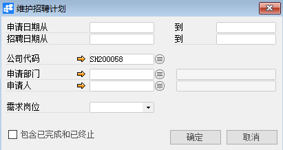
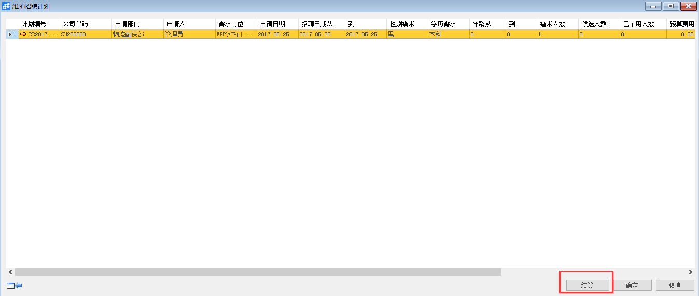
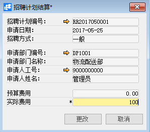

**维护招聘计划完成**

 

**功能解释**

在此功能模块中，用户可以对招聘计划的完成情况进行维护。

 

**文章主旨**

本文介绍如何通过BAP Business Cloud AI维护招聘计划完成操作。

**操作要求**

当前登陆用户拥有操作维护招聘计划完成的权限，权限设置请在帮助文档中搜索查看。

**维护招聘计划完成**

1、 从系统菜单->【人力资源】->【招聘管理】->【维护招聘计划完成】，打开查询界面；

2、 填写查询关键信息；

 

3、 点击【确定】进入结果界面；

4、 选择招聘计划，点击【结算】按钮；

5、 完善费用信息；

6、 点击【更改】或工具栏的保存按钮，保存结算信息。

 

 

**招聘计划查询界面**

| **属性**     | **活动描述**                                     |
| ------------------ | ------------------------------------------------------ |
| 申请日期从…到      | 申请日期区间                                           |
| 招聘日期从…到      | 招聘日期区间                                           |
| 公司代码           | 选择公司代码                                           |
| 申请部门           | 根据申请部门查询                                       |
| 申请人             | 根据申请人查询                                         |
| 需求岗位           | 根据需求岗位查询                                       |
| 包含已完成和已终止 | 选择后，在查询结果中将显示包含已完成和已终止的招聘计划 |

**招聘计划报表界面**

| **属性** | **活动描述** |
| -------------- | ------------------ |
| 计划编号       | 显示招聘计划的编号 |
| 公司代码       | 显示公司代码       |
| 申请部门       | 显示申请招聘的部门 |
| 申请人         | 显示招聘申请人     |
| 需求岗位       | 显示需求岗位       |
| 申请日期       | 显示申请日期       |
| 招聘日期从…到  | 显示招聘日期范围   |
| 性别需求       | 显示招聘性别需求   |
| 学历需求       | 显示招聘学历需求   |
| 年龄从…到      | 显示招聘年龄需求   |
| 需求人数       | 显示招聘需求人数   |
| 候选人数       | 显示招聘候选人数   |
| 已录用人数     | 显示招聘录用人数   |
| 预算费用       | 显示预算费用       |
| 实际费用       | 显示实际费用       |
| 描述           | 显示描述           |
| 备注           | 显示备注信息       |
| 行状态         | 显示单据行的状态   |
| 修改状态       | 显示修改状态       |

**招聘计划结算界面**

| **属性** | **活动描述** |
| -------------- | ------------------ |
| 招聘计划编号   | 显示招聘计划编号   |
| 申请日期       | 显示申请日期       |
| 招聘方式       | 显示招聘方式       |
| 申请部门编号   | 显示申请部门编号   |
| 申请部门名称   | 显示申请部门名称   |
| 申请人工号     | 显示申请人工号     |
| 申请人姓名     | 显示申请人姓名     |
| 预算费用       | 输入预算费用       |
| 实际费用       | 输入实际费用       |

 
