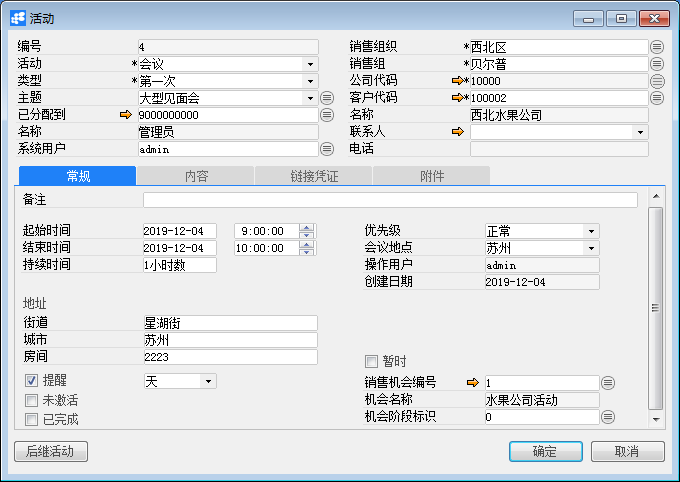
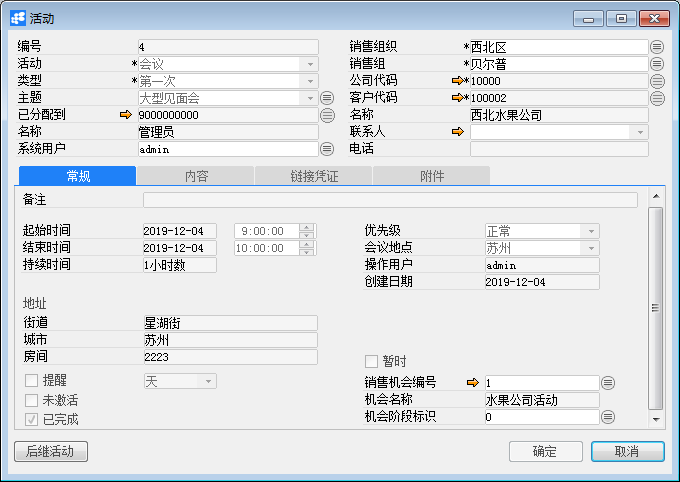
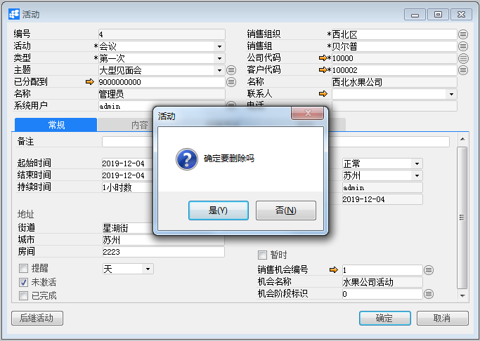

# 活动

## 功能解释 

BAP Business Cloud AI活动是指与客户之间的交互，例如电话呼叫、会议、任务或其他类型的活动。

在日历和活动报告中自动记录所有活动，以便于：

1、计划日、周和月；

2、分析与客户之间的通讯，包括当前开活动和已结束的活动；

3、监控销售机会的进度。

## 文章主旨 

本文介绍如何通过BAP Business Cloud AI完成活动的新增，修改，禁用，关闭及删除操作。

## 操作要求 

当前登录用户须拥有对活动创建，修改，禁用，关闭或删除的操作权限，如何设置该权限请在客户关系权限相关章节中搜索查看。

## 创建活动

1、从菜单窗口，【客户关系】->【活动】，打开活动窗口；

2、选择客户代码；

3、选择活动类型；

4、选择活动类型、主题；

5、选择已分与到员工、选择系统用户；

6、在常规、内容、链接凭证、附件选项卡中输入活动的必要信息；

7、单击“添加”按钮。  

如果同一个客户需要再次创建活动时，可以在常规选项卡中单击“后继活动”按扭创建活动。

## 更改活动

1、从菜单窗口，【客户关系】->【活动】，打开活动窗口；

2、单击工具栏上浏览按钮，选择要更改的活动；

3、对需要更改的活动进行更改，置灰的属性不允许修改；

4、单击“更改”按钮，状态栏上显示“更改已保存”，并且更改按钮已变为确定按钮，则更改成功。  

## 禁用活动

1、从菜单窗口，【客户关系】->【活动】，打开活动窗口；

2、单击工具栏浏览按钮，选择要禁用的活动；

3、在常规选项卡中，选择“未激活”；

4、单击“更改”按钮。

注意：要重新激活活动，请取消选择“未激活”。

## 关闭活动

1、从菜单窗口，【客户关系】->【活动】，打开活动窗口；

2、单击工具栏上浏览按钮，选择要关闭的活动；

3、在常规选项卡中，选择“已关闭”；

4、单击“更改”按钮。

注意：关闭活动后，将无法修改已完成的活动。

## 删除活动

1、从菜单窗口，【客户关系】->【活动】，打开活动窗口；

2、单击工具栏浏览按钮，选择要删除的活动；

3、单击工具栏‘删除当前记录’按钮；

4、在确认删除选择窗口中单击“是”，完成删除。

注意：活动完成后，将无法删除已完成的活动。

##  属性与活动描述

## 活动主数据

| 属性     | 活动描述                                                     |
| -------- | ------------------------------------------------------------ |
| 活动     | 选择合适的活动类型： 1、电话呼叫 2、会议 3、任务 4、注释 5、其它 |
| 类型     | 选择活动的更详细分类，譬如可以将“会议”归类为第一次会议、第二次议、最后一次会议 |
| 主题     | 根据活动的别一个详细分类，选择活动主题                       |
| 已分配到 | 选择处理活动的员工                                           |
| 系统用户 | 选择系统用户                                                 |
| 名称     | 显示系统用户的姓名                                           |
| 编号     | 活动创建成功后，自动生成的唯一活动编号                       |
| 销售组织 | 选择对应的销售组织                                           |
| 销售组   | 选择对应的销售组                                             |
| 公司代码 | 选择公司                                                     |
| 客户代码 | 选择与活动相关的客户代码                                     |
| 名称     | 根据客户代码显示客户名称                                     |
| 联系人   | 根据客户代码显示联系人                                       |
| 电话     | 根据联系人显示联系人电话                                     |

## 常规选项卡

| 属性         | 活动描述                                                     |
| ------------ | ------------------------------------------------------------ |
| 备注         | 输入活动的必要备注信息                                       |
| 起始时间     | 输入活动起始时间                                             |
| 结束时间     | 输入活动的结束时间，结束时间不能小于起始时间                 |
| 持续时间     | 根据起始时间与结束时间自动显示持续时间，活动为电话呼叫、会议时，持续时间才显示 |
| 状态         | 活动为任务时，状态字段才显示                                 |
| 优先级       | 选择活动的优先级                                             |
| 会议地点     | 选择活动的会议地址，活动为电话呼叫、会议、任务时会议地点字段才显示 |
| 操作用户     | 显示创建活动的系统用户                                       |
| 街道         | 活动状为会议时，街道字段才显示，记录会议的详细地址           |
| 城市         | 活动状为会议时，城市字段才显示，记录会议的详细地址           |
| 房间         | 活动状为会议时，房间字段才显示，记录会议的详细地址           |
| 提醒         | 暂缺                                                         |
| 暂时         | 活动状为会议时，字段才显示，功能暂缺                         |
| 未激活       | 是否已激活，未激活的活动不能创建销售机会                     |
| 已完成       | 是否已结算，已结算的活动不能修改或关闭活动                   |
| 销售机会编号 | 选择对应的销售机会                                           |
| 机会名称     | 显示销售机会的名称                                           |
| 机会阶段标识 | 显示销售机会的机会阶段标识                                   |

## 内容选项卡

| 属性 | 活动描述         |
| ---- | ---------------- |
| 内容 | 输入活动内容信息 |

## 链接凭证选项卡

| 属性                   | 活动描述                                 |
| ---------------------- | ---------------------------------------- |
| 单据类型               | 选择单据类型                             |
| 单据编号               | 输入%查找单据编号                        |
| 显示业务伙伴相关的凭证 | 是否根据客户代码过滤单据                 |
| 前一个作业             | 如果活动为后续活动，则显示基础活动的编号 |
| 源对象类型             | 指出是否通过销售机会创建活动             |
| 源对象编号             | 指示通过销售机会创建活动的编号           |

## 附件选项卡

| 属性     | 活动描述                     |
| -------- | ---------------------------- |
| 归档目录 | 显示归档的目录               |
| 归档描述 | 显示归档的描述               |
| 文档类别 | 显示文档的后缀               |
| 归档方式 | 显示归档的方式：上传或不上传 |
| 归档路径 | 显示归档路径                 |
| 文件名称 | 显示文件的名称               |
| 文件描述 | 显示文件的描述               |
| 文件路径 | 显示文件上传的路径           |
| 附件日期 | 显示文件上传的日期           |
| 上传进度 | 显示文件的上传进度           |
