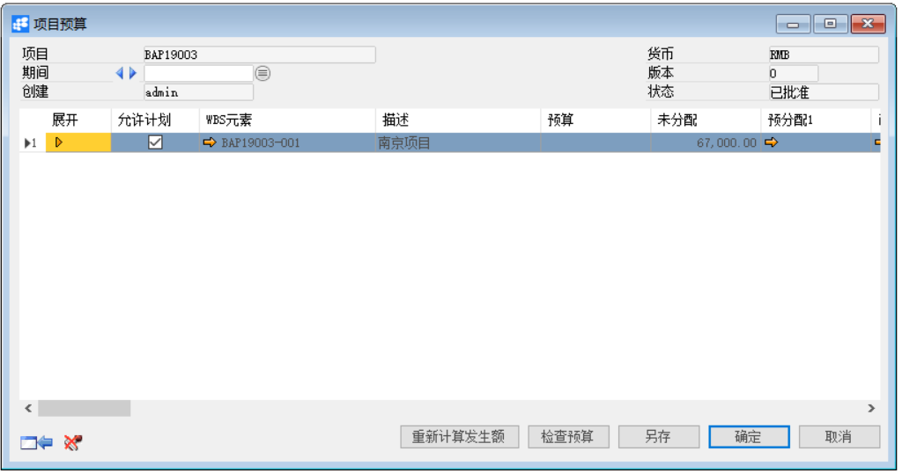
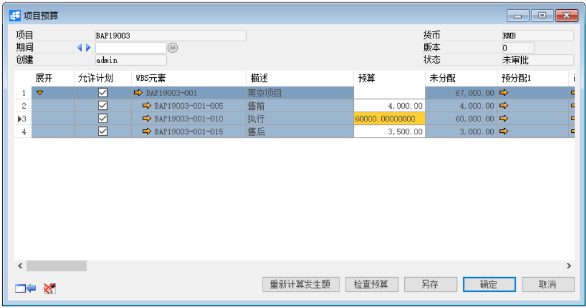

# 项目预算

 

## 功能解释

运用此功能可以对已定义的项目定义预算，项目预算就是用户根据多年的项目经验，预估项目的成本，也是作为项目结算的前置条件，也是项目资金控制的依据，当业务发生金额超出项目预算时，系统自动禁止业务发生，实时控制预算、。

## 文章主旨

本文介绍如何通过BAP Business Cloud AI完成定义项目预算的新增、修改操作。

## 操作要求

当前登录用户须拥有对定义项目控制码创建或更改的操作权限，如何设置该权限请在定义用户权限相关章节中搜索查看。

## 新建项目预算

1、 单击菜单模块【项目】->【规则】->【项目预算】，打开项目预算窗口；

2、 单击 查找项目；

3、 选择货币类型，选择版本号；

4、 单击【确定】按扭；

5、 输入预算值，如果要控制预算值，则选择中间检查，输入预算控制维度，如果预算控制维度相同，其中一个WBS超出了自身的预算但没有超出相同维度合计预算，则不算超出预算；

6、 可以输入容差%，容差值；选择是否控制累计支出金额；（如果项目选择的控制码是收支平衡控制，则这里直接输入允许溢出支出%和允许溢出支出金额；如果项目选择的控制码不是收支平衡控制，则这里选中冻结收支平衡控制码，和输入允许溢出支出%和允许溢出支出金额。）

7、 单击【更改】按扭。

   

8、 点击   按钮发起审批。

   

注：项目预算前置条件是：1、选择的项目必须有销售订单；

2、选择的项目状态必须是已批准。

 

## 修改项目预算

1、 单击菜单模块【项目】->【规划】->【项目预算】，打开项目预算窗口；

2、 选择项目、选择货币，单击[确定]按扭；

3、 点击   按钮撤销审核；

4、 修改项目预算内容。点击【更改】按钮保存。

   

5、 点击   按钮发起审批。

   

## 属性与活动描述

| **属性**           | **活动描述**                                                 |
| ------------------ | ------------------------------------------------------------ |
| 项目               | 显示预算的项目代码                                           |
| 期间               | 可以选择项目预算期间                                         |
| 创建               | 显示项目预算创建系统人员                                     |
| 货币               | 显示对象的实际成本金额                                       |
| 版本               | 显示版本号                                                   |
| 状态               | 显示项目预算状态                                             |
| 展开               | 是否展开项目的子级                                           |
| 允许计划           | 根据项目显示是否允计计划                                     |
| WBS元素            | 显示项目的WBS代码                                            |
| 描述               | 根据WBS元素显示项目描述                                      |
| 预算               | 输入预算金额                                                 |
| 未分配             | 项目预算下达后显示未分配金额                                 |
| 预分配1            | 项目预算下达后显示预分配1金额                                |
| 预分配2            | 项目预算下达后显示预分配2金额                                |
| 已占用             | 项目预算下达后显示已占用金额                                 |
| 合计               | 项目预算下达后显示合计金额                                   |
| WBS成本            | 项目预算下达后显示WBS 成本金额                               |
| 物料成本           | 项目预算下达后显示物料成本金额                               |
| 活动成本           | 项目预算下达后显示活动成本金额                               |
| 分类成本           | 项目预算下达后显示分类成本金额                               |
| 初级成本           | 项目预算下达后显示初级成本金额                               |
| 累计收入           | 项目预算下达后显示累计收入金额                               |
| 累计支出           | 项目预算下达后显示累计支出金额                               |
| 允许溢出支出%      | 输入允许溢出支出%，允许不超过累计支出+累计支出*允许溢出支出% |
| 允许溢出支出金额   | 输入允许溢出支出金额，允许不超过累计支出+允许溢出支出金额    |
| 冻结收支平衡控制码 | 是否冻结收支平衡控制码。 1）如果项目选择的控制码是收支平衡控制，则这里没有选中冻结收支平衡控制码，则表示控制溢出支出；2）如果项目选择的控制码是收支平衡控制，则这里选中冻结收支平衡控制码，则表示不控制溢出支出；3）如果项目选择的控制码不是收支平衡控制，则这里没有选中冻结收支平衡控制码，则表示不控制溢出支出；4）如果项目选择的控制码不是收支平衡控制，则这里选中冻结收支平衡控制码，则表示控制溢出支出；项目是否是收支平衡控制在项目模块下的定义菜单下的定义项控制制码中设置； |
| 容差               | 输入容差百分比                                               |
| 容差值             | 输入容差值                                                   |
| 容差因子           | 容差的又一维度                                               |
| 中间检查           | 是否中间检查，只有选中了才控制维度                           |
| 预算控制维度       | 中间检查选中，输入预算控制维度才有意义；预算模块下的定义预算控制维度中定义 |
| 维度名称           | 根据控制维度显示维度名称                                     |
| 预计-预分配1       | 保存项目预算但没有下达后的临时存放预分配1金额                |
| 预计-预分配2       | 保存项目预算但没有下达后的临时存放预分配2金额                |
| 预占用             | 保存项目预算但没有下达后的临时存放预占用金额                 |
| 预计收入           | 保存项目预算但没有下达后的临时存放预计收入金额               |
| 预计支出           | 保存项目预算但没有下达后的临时存放预计支出金额               |

 
